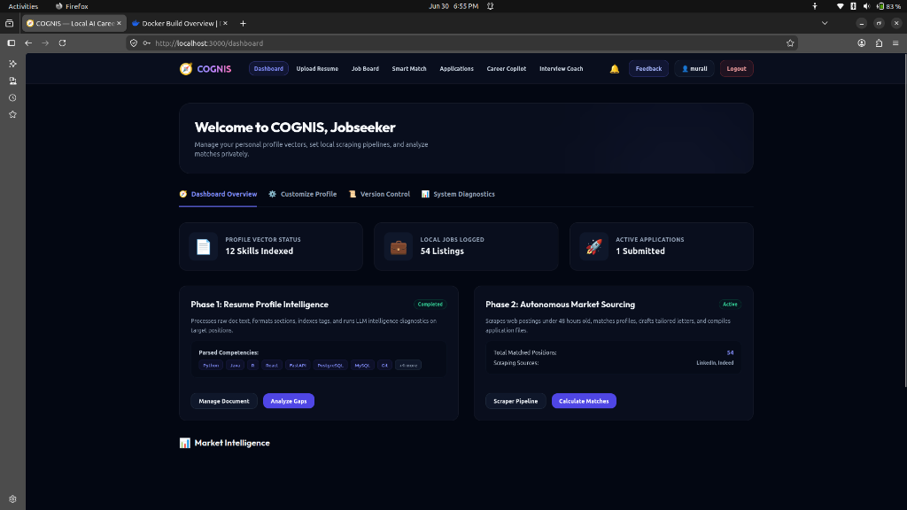
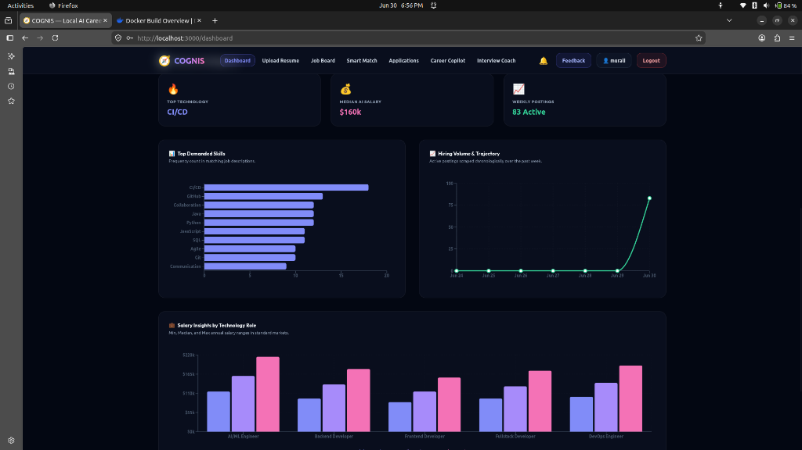
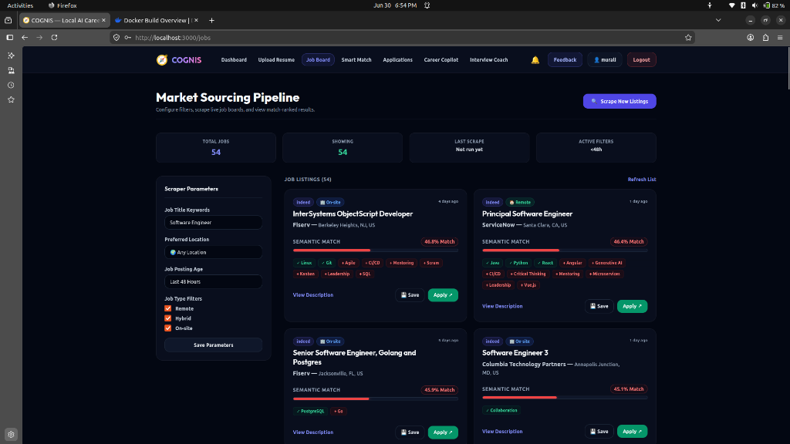
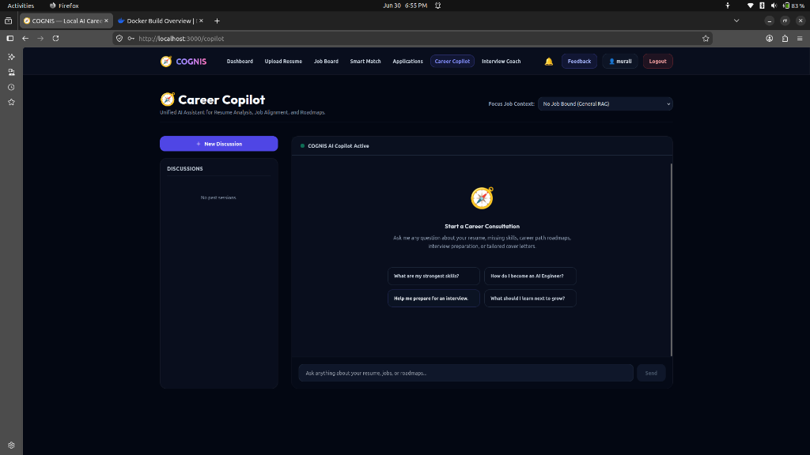
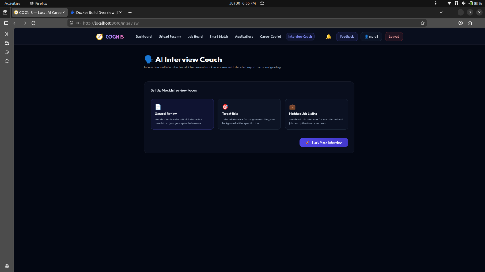

# COGNIS — Local AI Career Copilot

COGNIS is a production-ready, local-first AI career development assistant. It operates entirely on your local hardware to preserve privacy while analyzing resume skills, scraping active job postings, performing semantic vector matching, and tailoring cover letters and resume experience descriptions.

---

## 📸 App Screenshots

### Dashboard & Analytics
| Dashboard Overview | Market Intelligence |
| :---: | :---: |
|  |  |

### Job Board & AI Copilot
| Job Board Pipeline | Career Copilot AI |
| :---: | :---: |
|  |  |

### AI Interview Coach
| Mock Interviews |
| :---: |
|  |

---

## 🚀 Key Features

### Phase 1: Adaptive Career Intelligence (Local & Private)
*   **Secure Document Ingestion:** Extracts text from PDF and DOCX files.
*   **Skill Taxonomy Matching:** Matches NLP-extracted skills against a standardized dictionary.
*   **Local LLM Diagnostics:** Identifies skill gaps, makes learning recommendations, and drafts cover letters using **Qwen2.5:7b** running on Ollama.
*   **Tenant-Isolated Vectors:** Segments user resume chunks using `SentenceTransformer` embeddings saved in a persistent ChromaDB instance.

### Phase 2: Autonomous Market Sourcing & Tailoring
*   **Polite Job Scraping:** Uses custom delay parameters to scrape LinkedIn and Indeed.
*   **Vector Search Ranker:** Queries ChromaDB using cosine-similarity distances between resume profiles and job descriptions.
*   **Resume Tailoring Console:** Adjusts cover letters and resume bullet points to align with job descriptions.
*   **Submission Tracking:** Logs submission histories, tailored assets, and application notes.
*   **Transactional Notifications:** Automated email notifications (welcome, verification, digest) via Resend.

---

## 🛠️ Technology Stack

*   **Backend:** FastAPI, Python 3.11, PostgreSQL (user metadata/auth/history), ChromaDB (semantic search), spaCy (NLP), PyMuPDF/python-docx (resume parsers), APScheduler (automation).
*   **Frontend:** React 18, Vite, TailwindCSS (styling), Recharts (data visualization), Axios + TanStack React Query (server-state synchronization).
*   **AI Engine:** Local Ollama running `qwen2.5:7b` (or optional cloud-based Gemini 1.5).
*   **Email Deliverability:** Resend API integration.

---

## 🐳 Docker Deployment Options

COGNIS supports two Docker execution modes depending on your infrastructure requirements.

### Mode A: Single-Container Build (Recommended for Production & Cloud Hosting)
This mode packages both the React frontend and the FastAPI backend into a single container. The backend serves the compiled frontend static files from its own port (`8000`), meaning you only need to host one container.

1. **Build and Run the Container:**
   ```bash
   docker build -t cognis-app .
   docker run -d \
     -p 8000:8000 \
     -e DATABASE_URL="your_postgres_connection_string" \
     -e SECRET_KEY="your_secret_key" \
     -e OLLAMA_BASE_URL="http://host.docker.internal:11434" \
     -e RESEND_API_KEY="your_resend_api_key" \
     cognis-app
   ```
2. **Access the Application:**
   * Frontend & Backend API: [http://localhost:8000](http://localhost:8000)

---

### Mode B: Multi-Container Setup (Recommended for Local Development)
This mode spins up PostgreSQL, ChromaDB, Ollama, the backend, and the frontend in separate containers linked via a Docker network.

1. **Copy and configure environment settings:**
   ```bash
   cp .env.example .env
   # Edit .env with your PostgreSQL, Resend, and Ollama configurations
   ```
2. **Build and Start All Services:**
   ```bash
   docker-compose up --build
   ```
3. **Initialize Ollama Model inside the Ollama container:**
   ```bash
   docker exec -it cognis-ollama ollama pull qwen2.5:7b
   ```
4. **Access the Services:**
   * React Frontend: [http://localhost:3000](http://localhost:3000) (routed via Nginx)
   * FastAPI Backend: [http://localhost:8000](http://localhost:8000)
   * ChromaDB Port: [http://localhost:8004](http://localhost:8004)

---

## 💻 Manual Local Development Setup

If you prefer to run services manually on your local system:

### 1. Backend Service
1. Navigate to the backend directory:
   ```bash
   cd backend
   ```
2. Create and activate a virtual env:
   ```bash
   python -m venv venv
   source venv/bin/activate
   ```
3. Install dependencies:
   ```bash
   pip install -r requirements.txt
   python -m spacy download en_core_web_sm
   playwright install chromium
   playwright install-deps chromium
   ```
4. Copy and populate `backend/.env` with your values (including `DATABASE_URL` for PostgreSQL).
5. Start the server:
   ```bash
   uvicorn app.main:app --reload --port 8000
   ```

### 2. Frontend client
1. Navigate to the frontend directory:
   ```bash
   cd frontend
   ```
2. Install npm packages:
   ```bash
   npm install
   ```
3. Start the Vite development server:
   ```bash
   npm run dev
   ```
   *The client will run on [http://localhost:3000](http://localhost:3000).*

---

## 📡 Core API Endpoints

| Method | Endpoint | Description | Auth Required |
|---|---|---|---|
| **POST** | `/auth/register` | Register a new user account | No |
| **POST** | `/auth/login` | Authenticate credentials and get JWT token / cookie | No |
| **GET** | `/auth/me` | Fetch active user credentials | Yes |
| **GET** | `/auth/admin/stats` | Access system analytics and diagnostics | Yes (Admin) |
| **POST** | `/resume/upload` | Parse PDF/DOCX and save profile | Yes |
| **POST** | `/resume/analyze` | Trigger background skill diagnostics task | Yes |
| **POST** | `/resume/tailor` | Tailor resume keywords against specific job listings | Yes |
| **POST** | `/apply/generate/{job_id}` | Generate tailored application materials (bullets, cover letter) | Yes |
| **GET** | `/jobs/fetch` | Trigger manual job scraper background task | Yes |
| **POST** | `/jobs/match` | Query semantic similarity matching jobs from ChromaDB | Yes |
| **POST** | `/apply/submit` | Log job application history in PostgreSQL | Yes |
| **GET** | `/apply/history` | List application history logs | Yes |
| **GET** | `/jobs/{job_id}/status` | Check status of background AI tailoring tasks | Yes |
